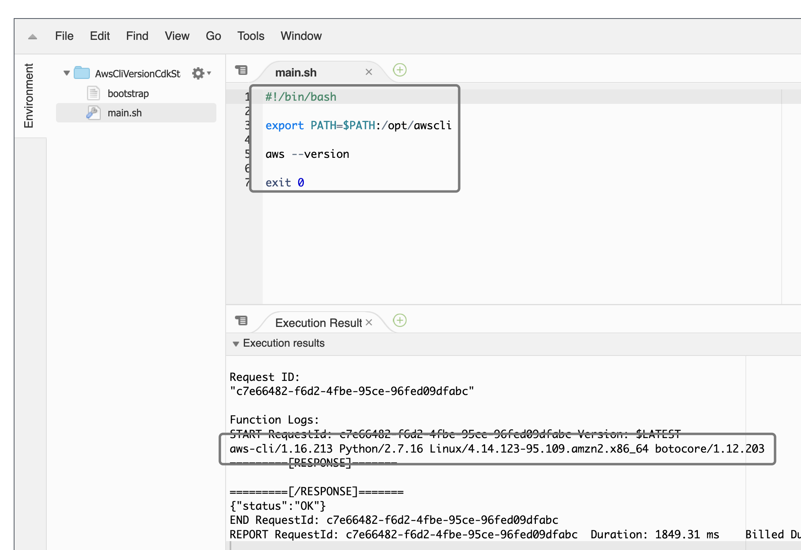

# aws version 

This sample execute `aws --version` from lambda.

## Deploy with AWS CDK

```bash
cd cdk
# install required modules from package.json
npm i
npm run build
cdk synth
cdk deploy
```

Go to lambda console and hit **Test** button. You'll see the `aws —version` output.

