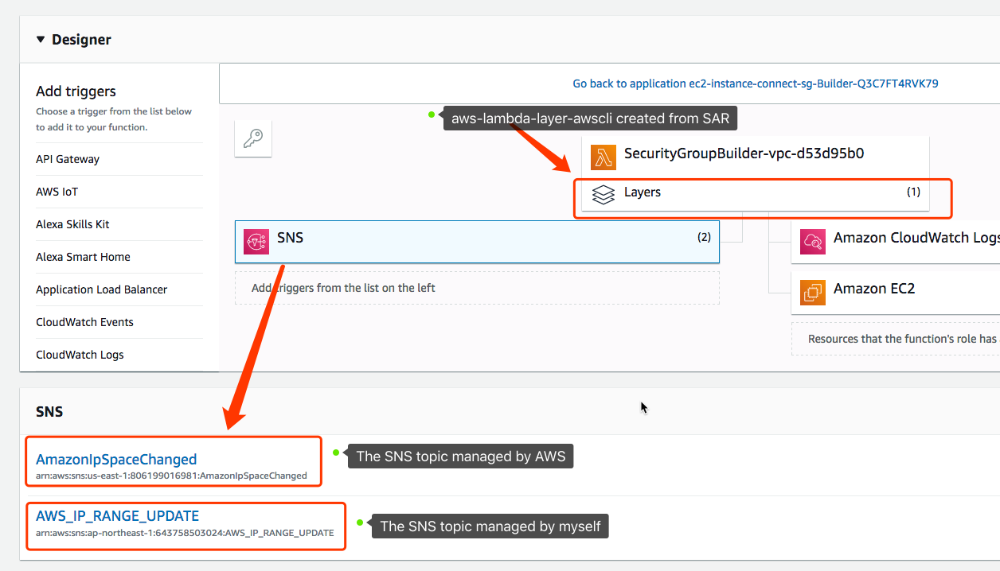

[](https://serverlessrepo.aws.amazon.com/applications/arn:aws:serverlessrepo:us-east-1:903779448426:applications~dynamic-security-group-builder)

#  dynamic-security-group-builder

**dynamic-security-group-builder** is a Serverless App that manages a security group for you with IP CIDR ranges from a specific service in this URL

**https://ip-ranges.amazonaws.com/ip-ranges.json** 


# Architecture


# Deploy the Serverless App with additional resources

We would deploy this serverless app and create the following additional resources:

1. An empty security group in the VPC you specified. This security group will be populated with CIDRs from [AWS IP ranges](https://ip-ranges.amazonaws.com/ip-ranges.json)
2. SNS subscription to [AWS IP Address Ranges Notifications](https://docs.aws.amazon.com/general/latest/gr/aws-ip-ranges.html#subscribe-notifications) with the Lambda function created from SAR and permissoin for this SNS topic to invoke this Lambda function(see [details](https://github.com/aws-samples/aws-lambda-layer-awscli/blob/29fca974c1c57bfd7a7c0cddd40fba3024256bd3/samples/dynamic-security-group/sam-sar.yaml#L45-L62)). When we receive the SNS notification from [AWS IP Address Ranges Notifications](https://docs.aws.amazon.com/general/latest/gr/aws-ip-ranges.html#subscribe-notifications), our Lambda function will update the security group immediately.

```bash
$ git clone https://github.com/aws-samples/aws-lambda-layer-awscli.git
$ aws-lambda-layer-awscli/samples/dynamic-security-group/
$ LAMBDA_REGION=ap-northeast-1 VPCID=vpc-d53d95b0 make sam-package-from-sar sam-deploy
Unable to find image 'pahud/aws-sam-cli:latest' locally
latest: Pulling from pahud/aws-sam-cli
921b31ab772b: Pull complete 
fd964b6953bd: Pull complete 
9a24a4db26ff: Pull complete 
23da9d4d439c: Pull complete 
5e148f2f18b1: Pull complete 
Digest: sha256:337b2955f7708b7c4554f469b9160c2cf582f7f78e03b2adf4a4fcbc0f530df4
Status: Downloaded newer image for pahud/aws-sam-cli:latest

Successfully packaged artifacts and wrote output template to file packaged.yaml.
Execute the following command to deploy the packaged template
aws cloudformation deploy --template-file /home/samcli/workdir/packaged.yaml --stack-name <YOUR STACK NAME>

Waiting for changeset to be created..
Waiting for stack create/update to complete
Successfully created/updated stack - ec2-instance-connect-sg
# print the cloudformation stack outputs
aws --region ap-northeast-1 cloudformation describe-stacks --stack-name "ec2-instance-connect-sg" --query 'Stacks[0].Outputs'
[
    {
        "OutputKey": "Result", 
        "OutputValue": "OK"
    }, 
    {
        "OutputKey": "GroupId", 
        "OutputValue": "sg-0097c386caea21fcf"
    }
]
```
You may list the CIDRs in the security group we just created above like this:

```bash
$ aws --region ap-northeast-1 ec2 describe-security-groups --group-ids sg-0097c386caea21fcf --query 'SecurityGroups[0].IpPermissions[0].IpRanges[*].CidrIp' --output table                                                                                                                                                                                           
------------------------
|DescribeSecurityGroups|
+----------------------+
|  13.209.1.56/29      |
|  13.233.177.0/29     |
|  13.239.158.0/29     |
|  13.52.6.112/29      |
|  18.202.216.48/29    |
|  18.206.107.24/29    |
|  18.228.70.32/29     |
|  18.237.140.160/29   |
|  3.0.5.32/29         |
|  3.112.23.0/29       |
|  3.120.181.40/29     |
|  3.16.146.0/29       |
|  3.8.37.24/29        |
|  35.180.112.80/29    |
|  35.183.92.176/29    |
+----------------------+
```


## SNS subscription to Lambda function

Go to AWS Lambda console and check your lambda function(default name is **SecurityGroupBuilder-vpc-xxxxxx**). Two SNS topics will be able to invoke this lambda function. One is **AmazonIpSpaceChanged**, which is managed by AWS, and the other(**AWS_IP_RANGE_UPDATE**) is a dummy empty SNS topic created by the cloudformation. Either SNS topic will be able to trigger Lambda function and update the security group.




# Test and Validation

Let's go to SNS console and publish a random message to **AWS_IP_RANGE_UPDATE** topic. You may also publish with AWS CLI like this:

```bash
$ aws --region ap-northeast-1 sns publish --topic-arn arn:aws:sns:ap-northeast-1:643758503024:AWS_IP_RANGE_UPDATE --message "test" 
{
    "MessageId": "341acbb3-59cd-534d-8fc8-9e2199f04c71"
}
```

And if you check the cloudwatch log for this lambda function you'll see this, which means the SNS notification has triggered the lambda function and the lambda function checks everything good without any modification on the security group. 

```
START RequestId: 519a6fd8-138b-4e32-857c-7b507e92a73b Version: $LATEST
=========[RESPONSE]=======
{
    "Records": [
        {
            "EventSource": "aws:sns",
            "EventVersion": "1.0",
            "EventSubscriptionArn": "arn:aws:sns:ap-northeast-1:643758503024:AWS_IP_RANGE_UPDATE:b2020be5-2081-429d-af1c-18420e70731f",
            "Sns": {
                "Type": "Notification",
                "MessageId": "341acbb3-59cd-534d-8fc8-9e2199f04c71",
                "TopicArn": "arn:aws:sns:ap-northeast-1:643758503024:AWS_IP_RANGE_UPDATE",
                "Subject": null,
                "Message": "test",
                "Timestamp": "2019-06-30T13:49:49.662Z",
                "SignatureVersion": "1",
                "Signature": "rjNROVtBlVPeRjcuz5psZ9TUM39krd8VSIyZ6SYDXFkY6Tev/fL+JoWdRTKQweHk2BA6eVNvAajLcl6r/tWY4oKZBVNv5bywMDyeK1PzU0op9OPy3Mnqq9E0CzfRCPFe91WSXb0PbnJV9NNcvTVisVBd57L9kRmcSxSzoY9HvuNSE9RoZmv4EDwp7EYF56kk/sqYrsp7DNI3bupqg9qFDP1erD62z6Z0qEq/K5UfknkGs8zSZeP+YuNv3OXPHoS80nODaVgi4h379H3JO2cegObvbUkrDc78xlWjG+ycaowp65D0PvGJkti57yM2YYtS+BR3GyRxK10Dh/QInbbWsw==",
                "SigningCertUrl": "https://sns.ap-northeast-1.amazonaws.com/SimpleNotificationService-6aad65c2f9911b05cd53efda11f913f9.pem",
                "UnsubscribeUrl": "https://sns.ap-northeast-1.amazonaws.com/?Action=Unsubscribe&SubscriptionArn=arn:aws:sns:ap-northeast-1:643758503024:AWS_IP_RANGE_UPDATE:b2020be5-2081-429d-af1c-18420e70731f",
                "MessageAttributes": {}
            }
        }
    ]
}
====[ new CIDRs ] ===
13.209.1.56/29 13.233.177.0/29 13.239.158.0/29 13.52.6.112/29 18.202.216.48/29 18.206.107.24/29 18.228.70.32/29 18.237.140.160/29 3.0.5.32/29 3.112.23.0/29 3.120.181.40/29 3.16.146.0/29 3.8.37.24/29 35.180.112.80/29 35.183.92.176/29
====[ end new CIDRs ] ===
====[ existing CIDRs ] ===
13.209.1.56/29 13.233.177.0/29 13.239.158.0/29 13.52.6.112/29 18.202.216.48/29 18.206.107.24/29 18.228.70.32/29 18.237.140.160/29 3.0.5.32/29 3.112.23.0/29 3.120.181.40/29 3.16.146.0/29 3.8.37.24/29 35.180.112.80/29 35.183.92.176/29
====[ end existing CIDRs ] ===
[INFO] start update sg
processing 13.209.1.56/29
[OK] 13.209.1.56/29 is already in existing cidrs
processing 13.233.177.0/29
[OK] 13.233.177.0/29 is already in existing cidrs
processing 13.239.158.0/29
[OK] 13.239.158.0/29 is already in existing cidrs
processing 13.52.6.112/29
[OK] 13.52.6.112/29 is already in existing cidrs
processing 18.202.216.48/29
[OK] 18.202.216.48/29 is already in existing cidrs
processing 18.206.107.24/29
[OK] 18.206.107.24/29 is already in existing cidrs
processing 18.228.70.32/29
[OK] 18.228.70.32/29 is already in existing cidrs
processing 18.237.140.160/29
[OK] 18.237.140.160/29 is already in existing cidrs
processing 3.0.5.32/29
[OK] 3.0.5.32/29 is already in existing cidrs
processing 3.112.23.0/29
[OK] 3.112.23.0/29 is already in existing cidrs
processing 3.120.181.40/29
[OK] 3.120.181.40/29 is already in existing cidrs
processing 3.16.146.0/29
[OK] 3.16.146.0/29 is already in existing cidrs
processing 3.8.37.24/29
[OK] 3.8.37.24/29 is already in existing cidrs
processing 35.180.112.80/29
[OK] 35.180.112.80/29 is already in existing cidrs
processing 35.183.92.176/29
[OK] 35.183.92.176/29 is already in existing cidrs
processing 13.209.1.56/29
[OK] 13.209.1.56/29 is still in the range
processing 13.233.177.0/29
[OK] 13.233.177.0/29 is still in the range
processing 13.239.158.0/29
[OK] 13.239.158.0/29 is still in the range
processing 13.52.6.112/29
[OK] 13.52.6.112/29 is still in the range
processing 18.202.216.48/29
[OK] 18.202.216.48/29 is still in the range
processing 18.206.107.24/29
[OK] 18.206.107.24/29 is still in the range
processing 18.228.70.32/29
[OK] 18.228.70.32/29 is still in the range
processing 18.237.140.160/29
[OK] 18.237.140.160/29 is still in the range
processing 3.0.5.32/29
[OK] 3.0.5.32/29 is still in the range
processing 3.112.23.0/29
[OK] 3.112.23.0/29 is still in the range
processing 3.120.181.40/29
[OK] 3.120.181.40/29 is still in the range
processing 3.16.146.0/29
[OK] 3.16.146.0/29 is still in the range
processing 3.8.37.24/29
[OK] 3.8.37.24/29 is still in the range
processing 35.180.112.80/29
[OK] 35.180.112.80/29 is still in the range
processing 35.183.92.176/29
[OK] 35.183.92.176/29 is still in the range
[INFO] asending response success
=========[/RESPONSE]=======
% Total % Received % Xferd Average Speed Time Time Time Current
Dload Upload Total Spent Left Speed

0 0 0 0 0 0 0 0 --:--:-- --:--:-- --:--:-- 0
100 3949 100 16 100 3933 16000 3840k --:--:-- --:--:-- --:--:-- 3856k
{
    "status": "OK"
}
END RequestId: 519a6fd8-138b-4e32-857c-7b507e92a73b
REPORT RequestId: 519a6fd8-138b-4e32-857c-7b507e92a73b Init Duration: 30.99 ms Duration: 2477.66 ms Billed Duration: 2600 ms Memory Size: 1024 MB Max Memory Used: 150 MB 
```

However, if we manually modify the content of that security group and send the SNS again, you'll see similar logs like this:

```
[INFO] start update sg
processing 13.209.1.56/29
[WARNING] 13.209.1.56/29 not in existing cidrs, add into SG now
processing 13.209.0.0/21
[WARNING] 13.209.0.0/21 not in new cidr anymore, revoking 13.209.0.0/21
[INFO] asending response success
```

In this case the Lambda function will first add new CIDRs into this security group followed by removing old CIDRs which will have been invalid. This will make sure all new CIDRs will be added into the security group as fast as possible.


# Click and Deploy the Serverless App only from SAR

If you'd just like to create the serverless app without additional resources described above, you can simply click the button below for the deployment.

By clicking the following button, SAR will create this stack for you on your region. You must provide an existing **Security Group ID** and **VPC ID** before SAR can deploy this stack for you to maintain the Security Group you provided on receiving SNS topics.

|        Region        |                    Click and Deploy                     |
| :----------------: | :----------------------------------------------------------: |
|  **ap-northeast-1**  |[](https://deploy.serverlessrepo.app/ap-northeast-1/?app=arn:aws:serverlessrepo:us-east-1:903779448426:applications/dynamic-security-group-builder)|
|  **ap-northeast-2**  |[](https://deploy.serverlessrepo.app/ap-northeast-2/?app=arn:aws:serverlessrepo:us-east-1:903779448426:applications/dynamic-security-group-builder)|
|  **ap-northeast-3**  |[](https://deploy.serverlessrepo.app/ap-northeast-3/?app=arn:aws:serverlessrepo:us-east-1:903779448426:applications/dynamic-security-group-builder)|
|  **ap-south-1**  |[](https://deploy.serverlessrepo.app/ap-south-1/?app=arn:aws:serverlessrepo:us-east-1:903779448426:applications/dynamic-security-group-builder)|
|  **ap-southeast-1**  |[](https://deploy.serverlessrepo.app/ap-southeast-1/?app=arn:aws:serverlessrepo:us-east-1:903779448426:applications/dynamic-security-group-builder)|
|  **ap-southeast-2**  |[](https://deploy.serverlessrepo.app/ap-southeast-2/?app=arn:aws:serverlessrepo:us-east-1:903779448426:applications/dynamic-security-group-builder)|
|  **ca-central-1**  |[](https://deploy.serverlessrepo.app/ca-central-1/?app=arn:aws:serverlessrepo:us-east-1:903779448426:applications/dynamic-security-group-builder)|
|  **eu-central-1**  |[](https://deploy.serverlessrepo.app/eu-central-1/?app=arn:aws:serverlessrepo:us-east-1:903779448426:applications/dynamic-security-group-builder)|
|  **eu-north-1**  |[](https://deploy.serverlessrepo.app/eu-north-1/?app=arn:aws:serverlessrepo:us-east-1:903779448426:applications/dynamic-security-group-builder)|
|  **eu-west-1**  |[](https://deploy.serverlessrepo.app/eu-west-1/?app=arn:aws:serverlessrepo:us-east-1:903779448426:applications/dynamic-security-group-builder)|
|  **eu-west-2**  |[](https://deploy.serverlessrepo.app/eu-west-2/?app=arn:aws:serverlessrepo:us-east-1:903779448426:applications/dynamic-security-group-builder)|
|  **eu-west-3**  |[](https://deploy.serverlessrepo.app/eu-west-3/?app=arn:aws:serverlessrepo:us-east-1:903779448426:applications/dynamic-security-group-builder)|
|  **sa-east-1**  |[](https://deploy.serverlessrepo.app/sa-east-1/?app=arn:aws:serverlessrepo:us-east-1:903779448426:applications/dynamic-security-group-builder)|
|  **us-east-1**  |[](https://deploy.serverlessrepo.app/us-east-1/?app=arn:aws:serverlessrepo:us-east-1:903779448426:applications/dynamic-security-group-builder)|
|  **us-east-2**  |[](https://deploy.serverlessrepo.app/us-east-2/?app=arn:aws:serverlessrepo:us-east-1:903779448426:applications/dynamic-security-group-builder)|
|  **us-west-1**  |[](https://deploy.serverlessrepo.app/us-west-1/?app=arn:aws:serverlessrepo:us-east-1:903779448426:applications/dynamic-security-group-builder)|
|  **us-west-2**  |[](https://deploy.serverlessrepo.app/us-west-2/?app=arn:aws:serverlessrepo:us-east-1:903779448426:applications/dynamic-security-group-builder)|

