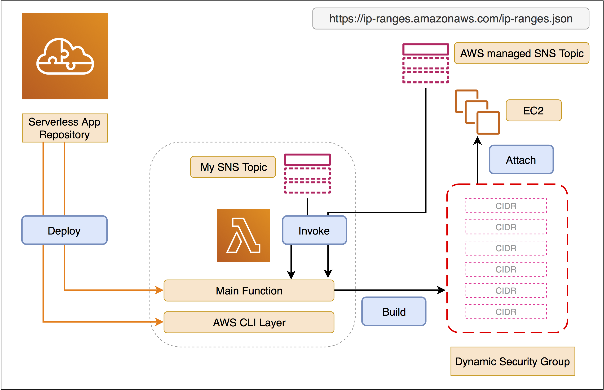

[](https://serverlessrepo.aws.amazon.com/applications/arn:aws:serverlessrepo:us-east-1:903779448426:applications~dynamic-security-group-builder)

#  dynamic-security-group-builder

**dynamic-security-group-builder** is a Serverless App that manages a security group for you with IP CIDR ranges from a specific service in this URL

**https://ip-ranges.amazonaws.com/ip-ranges.json** 


# Architecture




# Deploy the Serverless App with additional resources

We would deploy this serverless app and create the following additional resources:

1. An empty security group in the VPC you specified. This security group will be populated with CIDRs from [AWS IP ranges](https://ip-ranges.amazonaws.com/ip-ranges.json)
2. SNS subscription to [AWS IP Address Ranges Notifications](https://docs.aws.amazon.com/general/latest/gr/aws-ip-ranges.html#subscribe-notifications) with the Lambda function created from SAR and permissoin for this SNS topic to invoke this Lambda function(see [details](https://github.com/aws-samples/aws-lambda-layer-awscli/blob/29fca974c1c57bfd7a7c0cddd40fba3024256bd3/samples/dynamic-security-group/sam-sar.yaml#L45-L62)). When we receive the SNS notification from [AWS IP Address Ranges Notifications](https://docs.aws.amazon.com/general/latest/gr/aws-ip-ranges.html#subscribe-notifications), our Lambda function will update the security group immediately.

```bash
$ git clone https://github.com/aws-samples/aws-lambda-layer-awscli.git
$ aws-lambda-layer-awscli/samples/dynamic-security-group/
$ LAMBDA_REGION=ap-northeast-1 VPCID=vpc-d53d95b0 make sam-package-from-sar sam-deploy
Unable to find image 'pahud/aws-sam-cli:latest' locally
latest: Pulling from pahud/aws-sam-cli
921b31ab772b: Pull complete 
fd964b6953bd: Pull complete 
9a24a4db26ff: Pull complete 
23da9d4d439c: Pull complete 
5e148f2f18b1: Pull complete 
Digest: sha256:337b2955f7708b7c4554f469b9160c2cf582f7f78e03b2adf4a4fcbc0f530df4
Status: Downloaded newer image for pahud/aws-sam-cli:latest

Successfully packaged artifacts and wrote output template to file packaged.yaml.
Execute the following command to deploy the packaged template
aws cloudformation deploy --template-file /home/samcli/workdir/packaged.yaml --stack-name <YOUR STACK NAME>

Waiting for changeset to be created..
Waiting for stack create/update to complete
Successfully created/updated stack - ec2-instance-connect-sg
# print the cloudformation stack outputs
aws --region ap-northeast-1 cloudformation describe-stacks --stack-name "ec2-instance-connect-sg" --query 'Stacks[0].Outputs'
[
    {
        "OutputKey": "Result", 
        "OutputValue": "OK"
    }, 
    {
        "OutputKey": "GroupId", 
        "OutputValue": "sg-0097c386caea21fcf"
    }
]
```
You may list the CIDRs in the security group we just created above like this:

```bash
$ aws --region ap-northeast-1 ec2 describe-security-groups --group-ids sg-0097c386caea21fcf --query 'SecurityGroups[0].IpPermissions[0].IpRanges[*].CidrIp' --output table                                                                                                                                                                                           
------------------------
|DescribeSecurityGroups|
+----------------------+
|  13.209.1.56/29      |
|  13.233.177.0/29     |
|  13.239.158.0/29     |
|  13.52.6.112/29      |
|  18.202.216.48/29    |
|  18.206.107.24/29    |
|  18.228.70.32/29     |
|  18.237.140.160/29   |
|  3.0.5.32/29         |
|  3.112.23.0/29       |
|  3.120.181.40/29     |
|  3.16.146.0/29       |
|  3.8.37.24/29        |
|  35.180.112.80/29    |
|  35.183.92.176/29    |
+----------------------+
```


# Click and Deploy the Serverless App only from SAR

If you'd just like to create the serverless app without additional resources described above, you can simply click the button below for the deployment.

By clicking the following button, SAR will create this stack for you on your region. You must provide an existing **Security Group ID** and **VPC ID** before SAR can deploy this stack for you to maintain the Security Group you provided on receiving SNS topics.

|        Region        |                    Click and Deploy                     |
| :----------------: | :----------------------------------------------------------: |
|  **ap-northeast-1**  |[](https://deploy.serverlessrepo.app/ap-northeast-1/?app=arn:aws:serverlessrepo:us-east-1:903779448426:applications/dynamic-security-group-builder)|
|  **ap-northeast-2**  |[](https://deploy.serverlessrepo.app/ap-northeast-2/?app=arn:aws:serverlessrepo:us-east-1:903779448426:applications/dynamic-security-group-builder)|
|  **ap-northeast-3**  |[](https://deploy.serverlessrepo.app/ap-northeast-3/?app=arn:aws:serverlessrepo:us-east-1:903779448426:applications/dynamic-security-group-builder)|
|  **ap-south-1**  |[](https://deploy.serverlessrepo.app/ap-south-1/?app=arn:aws:serverlessrepo:us-east-1:903779448426:applications/dynamic-security-group-builder)|
|  **ap-southeast-1**  |[](https://deploy.serverlessrepo.app/ap-southeast-1/?app=arn:aws:serverlessrepo:us-east-1:903779448426:applications/dynamic-security-group-builder)|
|  **ap-southeast-2**  |[](https://deploy.serverlessrepo.app/ap-southeast-2/?app=arn:aws:serverlessrepo:us-east-1:903779448426:applications/dynamic-security-group-builder)|
|  **ca-central-1**  |[](https://deploy.serverlessrepo.app/ca-central-1/?app=arn:aws:serverlessrepo:us-east-1:903779448426:applications/dynamic-security-group-builder)|
|  **eu-central-1**  |[](https://deploy.serverlessrepo.app/eu-central-1/?app=arn:aws:serverlessrepo:us-east-1:903779448426:applications/dynamic-security-group-builder)|
|  **eu-north-1**  |[](https://deploy.serverlessrepo.app/eu-north-1/?app=arn:aws:serverlessrepo:us-east-1:903779448426:applications/dynamic-security-group-builder)|
|  **eu-west-1**  |[](https://deploy.serverlessrepo.app/eu-west-1/?app=arn:aws:serverlessrepo:us-east-1:903779448426:applications/dynamic-security-group-builder)|
|  **eu-west-2**  |[](https://deploy.serverlessrepo.app/eu-west-2/?app=arn:aws:serverlessrepo:us-east-1:903779448426:applications/dynamic-security-group-builder)|
|  **eu-west-3**  |[](https://deploy.serverlessrepo.app/eu-west-3/?app=arn:aws:serverlessrepo:us-east-1:903779448426:applications/dynamic-security-group-builder)|
|  **sa-east-1**  |[](https://deploy.serverlessrepo.app/sa-east-1/?app=arn:aws:serverlessrepo:us-east-1:903779448426:applications/dynamic-security-group-builder)|
|  **us-east-1**  |[](https://deploy.serverlessrepo.app/us-east-1/?app=arn:aws:serverlessrepo:us-east-1:903779448426:applications/dynamic-security-group-builder)|
|  **us-east-2**  |[](https://deploy.serverlessrepo.app/us-east-2/?app=arn:aws:serverlessrepo:us-east-1:903779448426:applications/dynamic-security-group-builder)|
|  **us-west-1**  |[](https://deploy.serverlessrepo.app/us-west-1/?app=arn:aws:serverlessrepo:us-east-1:903779448426:applications/dynamic-security-group-builder)|
|  **us-west-2**  |[](https://deploy.serverlessrepo.app/us-west-2/?app=arn:aws:serverlessrepo:us-east-1:903779448426:applications/dynamic-security-group-builder)|

